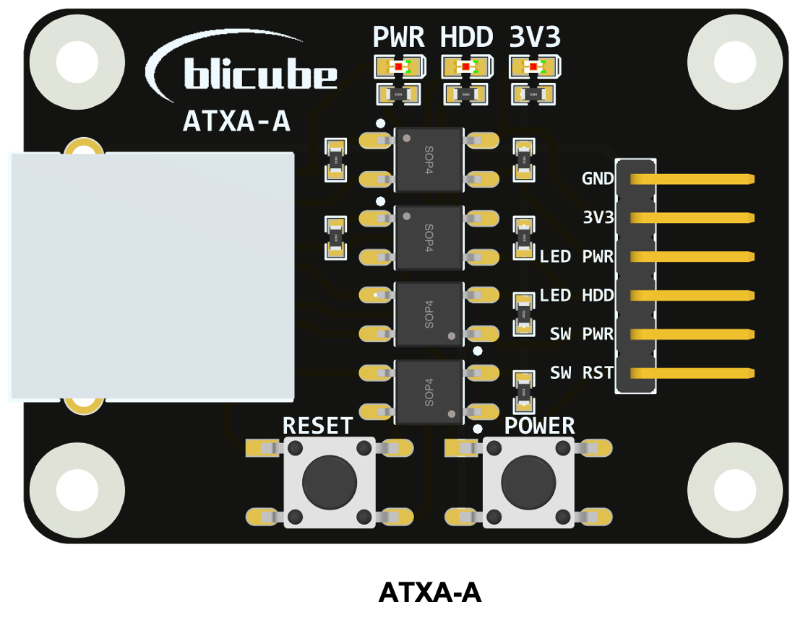
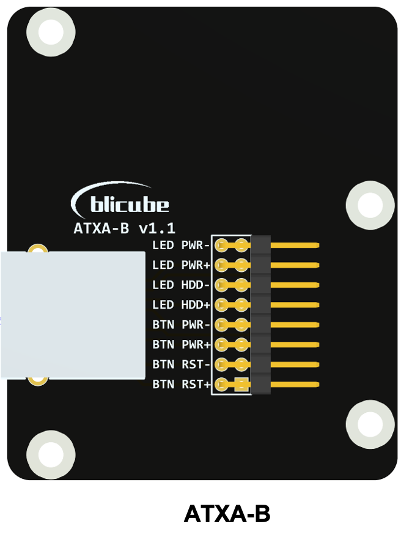
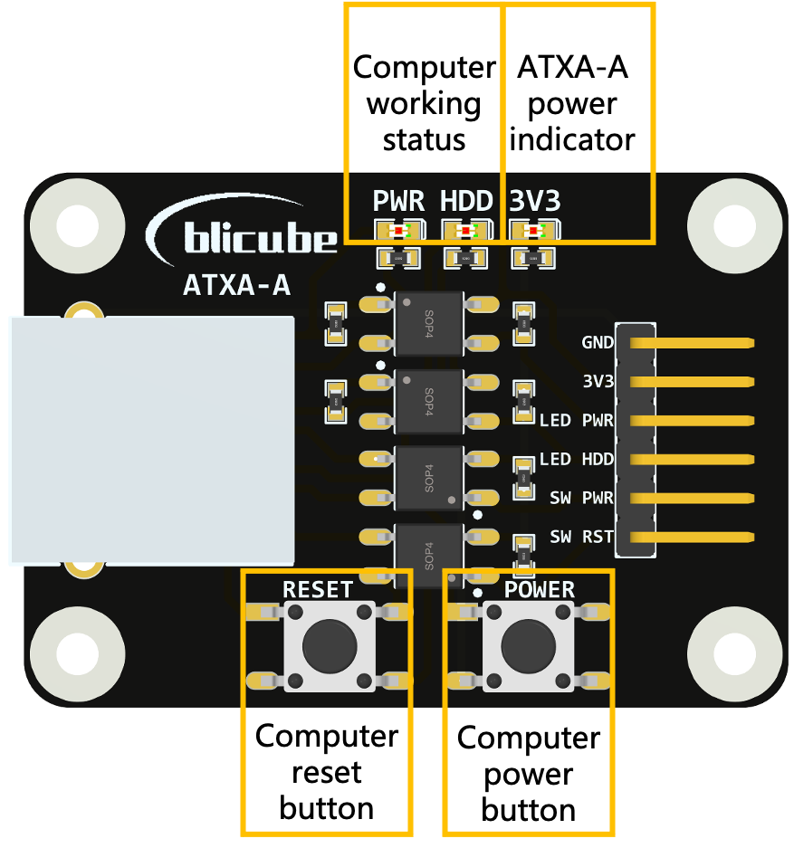
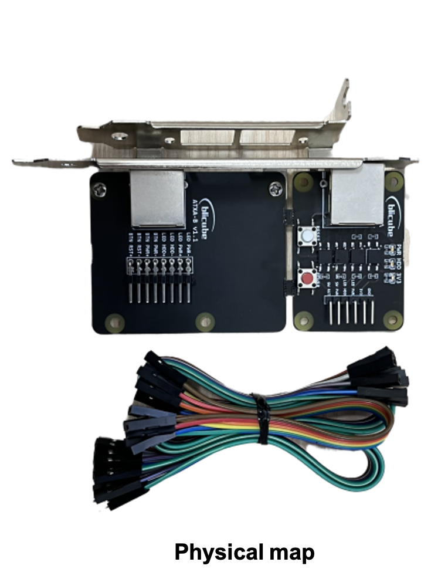
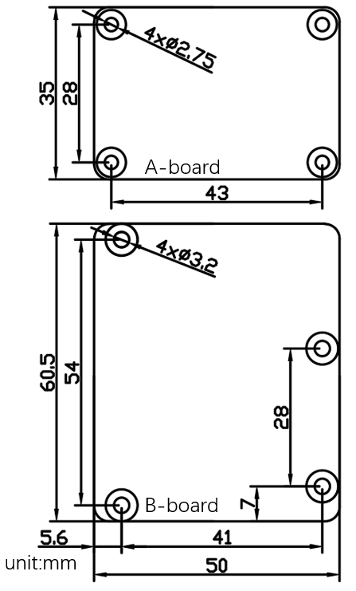

# ATXA

## 1. Introduction

ATXA is an ATX adapter borad to manage the power of your computer. The product includes two modules A-board and B-board. A-board is connected to the Raspberry Pi, B-board is connected to the computer's motherboard, and A-board is connected to B-board through a network cable.

## 2. A-board
 A-board is connected to the Raspberry Pi. The following table is a typical connection method in PiKVM application.

| A-board | RPI4   |
| ------- | ------ |
| GND     | GND    |
| 3V3     | 3V3    |
| LED PWR | GPIO24 |
| LED HDD | GPIO22 |
| SW PWR  | GPIO23 |
| SW RST  | GPIO27 |

A-board is connected to B-board through a network cable. The following table is the corresponding relationship between the pin status of A-board and B-board.

| Pins on A-board | Pins on B-board |
| --------------- | ----------------- |
| LED PWR is HIGH | LED PWR+ is HIGH,  LED PWR- is LOW |
| LED PWR is LOW | LED PWR+ is LOW,  LED PWR- is LOW |
| LED HDD is HIGH | LED HDD+ is HIGH,  LED HDD- is LOW |
| LED HDD is LOW | LED HDD+ is LOW,  LED HDD- is LOW |
| SW PWR is HIGH | BTN PWR+ and BTN PWR- connected, the power button is pressed |
| SW PWR is LOW | BTN PWR+ and BTN PWR- disconnected, the power button is unpressed |
| SW RST is HIGH | BTN RST+ and BTN RST- connected, the reset button is pressed |
| SW RST is LOW | BTN RST+ and BTN RST- disconnected, the reset button is unpressed |

## 3. B-board

The b-board has an adapted full-height and half-height metal PCI mounting plate, which can be installed on the computer case. The user connects the pins on the B-board to the ATX control interface on the computer motherboard using the color DuPont cables provided with the product.

## 3.Mechanical Diagram

## 4.More link
Purchase：<a href="https://www.aliexpress.com/item/1005003761450893.html?spm=a2g0o.store_pc_allProduct.8148356.12.4c8f16b4prvvUV" target="_blank">BLIKVM</a>
